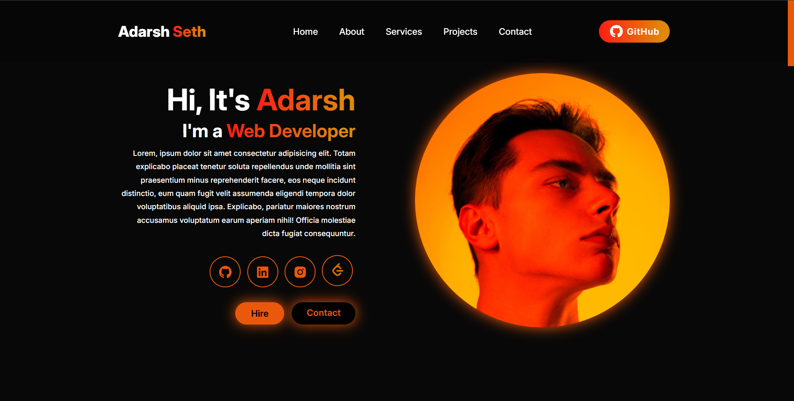

# 💼 Adarsh Seth - Portfolio Website

Welcome to my personal portfolio website! This project showcases my skills, projects, and services as a web developer. It is designed with a modern UI, smooth animations, and a fully responsive layout.

## 🚀 Live Demo

🔗 https://adarsh-seth-portfolio.vercel.app


## 📸 Preview




## ✨ Features

- 🎨 Modern and clean UI
- 📱 Fully responsive design
- 🌙 Dark-themed interface
- 🚀 Smooth scrolling navigation
- 📌 Sticky navigation bar
- 📂 Projects showcase section
- 👨‍💻 About Me section
- 💼 Services section
- 📬 Contact form using Formspree
- 🔗 Social media links
- ⚡ Smooth hover animations


## 🛠️ Built With

- HTML5
- CSS3
- JavaScript (ES6)
- Boxicons
- Google Fonts (Poppins)
- Formspree (Contact Form)


## 📂 Project Structure

```
portfolio
 ┣ static
 ┃ ┣ image.jpg
 ┃ ┣ project1.png
 ┃ ┣ project2.png
 ┃ ┣ project3.png
 ┃ ┣ project4.png
 ┃ ┣ project5.png
 ┃ ┗ project6.png
 ┣ index.html
 ┣ README.md
 ┣ script.js
 ┗ style.css
```


## 📖 Sections

- Home
- About
- Services
- Projects
- Contact
- Footer


## 📱 Responsive Design

The portfolio is optimized for:

- Desktop 💻
- Laptop 🖥️
- Tablet 📱
- Mobile 📲


## ⚙️ Installation

Clone the repository

```bash
git clone https://github.com/adarsh-seth/Portfolio.git
```

Go to the project folder

```bash
cd portfolio
```

Open `index.html` in your browser

or use VS Code Live Server.


## 📧 Contact

**Adarsh Seth**

- GitHub: https://github.com/adarsh-seth
- LinkedIn: https://www.linkedin.com/in/adarsh-seth/
- Email: adarshseth999@gmail.com


## 🎯 Future Improvements

- Add React version
- Add project filtering
- Add typing animation
- Add ScrollReveal animations
- Add downloadable resume
- Add blog section
- Improve accessibility
- Optimize performance


### Made with ❤️ by Adarsh Seth